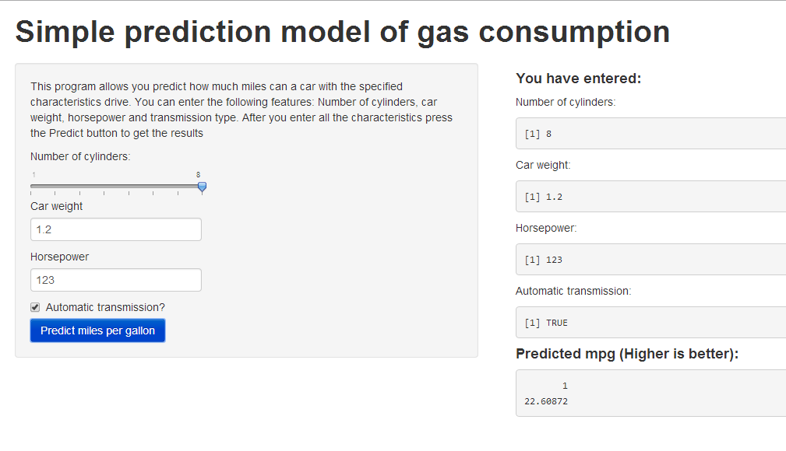

How to predict car's miles per gallon?
========================================================
author: Ishitori (Sergey Sokolov)
date: 8/23/2014

The Problem
========================================================

Imagine, you want to buy a car. You want to have a good car which consumes a little of petrol. 

**But how do you figure out which car to choose if there is so little trust to car sellers?**

Looking for the solution
========================================================

There is a pattern between mpg and other car characteristics consider this chart

 

Mpg decreases with increasing number of cylinders and AT cars consumes less petrol than MT cars.
**We can use this to predict mpg based on other car's characteristics**

The solution
========================================================

Take the following characteristics:

- Cylinders number
- Weight
- Horsepower
- Transmission type

and use random forest to get MPG!

Th result: Introducing MPG prediction app
========================================================

The app is available here: http://ishitori.shinyapps.io/CourseProject/
